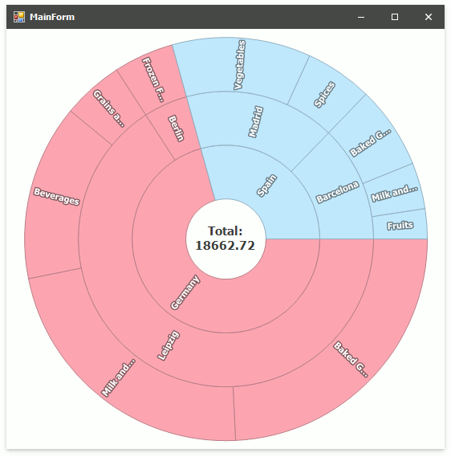

<!-- default badges list -->

<!-- default badges end -->
## How to: provide hierarchical data to Sunburst

This example demonstrates how to visualize hierarchical data using the SunburstControl.

### Description

Create a **SunburstHierarchicalDataAdapter** object and assign it to the **SunburstControl.DataAdapter** property to provide hierarchical data to Sunburst. Then, specify the adapter's data source object using the **DataSource** property. Use **SunburstHierarchicalDataMapping** objects to configure how the SunburstControl should convert hierarchical data to sunburst items. The **LabelDataMember** property allows you to specify a label data member, the **ValueDataMember** property - a value data member, the **ChildrenDataMember** property - a data member that contains children items and the **Type** property - a type of items at the current level.
